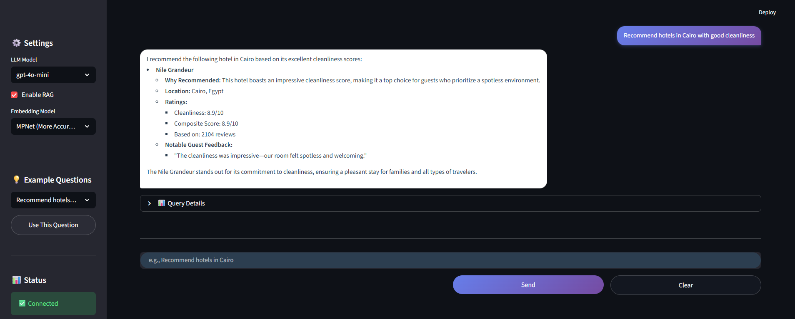

# International Hotel Booking Assistant

An AI-powered hotel recommendation system built as part of the Advanced Computer Lab (CSEN 903) course at the German University in Cairo. This project demonstrates the complete AI pipeline from statistical prediction to symbolic knowledge representation to natural language generation.

## Overview

This project implements an intelligent assistant for international hotel booking that helps travelers make informed decisions and supports hotels in improving service quality. The system analyzes customer reviews, demographic information, and hotel attributes to provide personalized recommendations, answer queries, and offer insights about accommodations worldwide.

## Project Milestones

The project is structured in three progressive milestones, each building upon the previous one:

### Milestone 1: Predictive Machine Learning
- **Objective**: Build statistical models to predict hotel ratings and analyze customer satisfaction
- **Key Tasks**:
  - Data cleaning and preprocessing of hotel booking dataset
  - Exploratory data analysis and feature engineering
  - Predictive modeling for value-for-money scores
  - Model evaluation and explainability (SHAP, LIME)
- **Deliverables**: Jupyter notebook with comprehensive analysis and visualizations

### Milestone 2: Knowledge Graph Construction
- **Objective**: Create a structured knowledge representation using Neo4j
- **Key Tasks**:
  - Design graph schema (Hotels, Cities, Countries, Travelers, Reviews)
  - Build relationships (LOCATED_IN, STAYED_AT, WROTE, REVIEWED, NEEDS_VISA)
  - Implement Cypher queries for structured data retrieval
  - Enable semantic reasoning over hotel domain
- **Deliverables**: Neo4j knowledge graph with automated creation scripts

### Milestone 3: Generative AI Chatbot
- **Objective**: Develop an interactive conversational assistant using LLMs
- **Key Tasks**:
  - Intent classification and entity extraction
  - Hybrid retrieval (Knowledge Graph + RAG with embeddings)
  - LLM-powered response generation
  - Streamlit web interface
- **Deliverables**: Production-ready chatbot application

## Features

- **Intelligent Query Understanding**: Classifies user intent and extracts relevant entities
- **Hybrid Knowledge Retrieval**:
  - Structured queries via Neo4j knowledge graph
  - Semantic search using sentence embeddings (RAG)
- **Multi-Model Support**: Choose between GPT-4o, GPT-4o-mini, or GPT-4-turbo
- **Flexible Embedding Models**: MiniLM (faster) or MPNet (more accurate)
- **Interactive Web Interface**: Built with Streamlit for easy access
- **Query Types Supported**:
  - List hotels by location/attributes
  - Get personalized recommendations
  - Describe specific hotels
  - Compare multiple hotels
  - Check visa requirements between countries

## Technologies Used

### Data Science & ML
- **Python 3.x**: Core programming language
- **Pandas & NumPy**: Data manipulation and analysis
- **Scikit-learn**: Machine learning models
- **Matplotlib & Seaborn**: Data visualization
- **SHAP & LIME**: Model explainability

### Knowledge Graph
- **Neo4j**: Graph database for structured knowledge
- **Cypher**: Query language for graph traversal

### Natural Language Processing
- **OpenAI API**: GPT-4 models for generation
- **Sentence Transformers**: Embedding models (all-MiniLM-L6-v2, all-mpnet-base-v2)
- **Custom NLP Pipeline**: Intent classification and entity extraction

### Web Application
- **Streamlit**: Interactive web interface
- **Python-dotenv**: Environment variable management

## Installation

### Prerequisites
- Python 3.8 or higher
- Neo4j database (cloud or local instance)
- OpenAI API key

### Setup

1. **Clone the repository**
```bash
git clone <your-repository-url>
cd Project
```

2. **Create virtual environment (recommended)**
```bash
python -m venv .venv
source .venv/bin/activate  # On Windows: .venv\Scripts\activate
```

3. **Install dependencies**
```bash
cd "Milestone 3"
pip install -r requirements.txt
```

4. **Configure environment variables**

Create a `.env` file in the `Milestone 3` directory:
```env
OPENAI_API_KEY=your-openai-api-key-here
```

5. **Configure Neo4j connection**

Update `Milestone 3/KnowledgeGraph/config.txt`:
```
URI=your-neo4j-uri
USERNAME=your-username
PASSWORD=your-password
```

6. **Load the Knowledge Graph** (if needed)
```bash
cd "Milestone 3/KnowledgeGraph"
python Create_kg.py
```

## Usage

### Running the Chatbot

1. Navigate to Milestone 3 directory:
```bash
cd "Milestone 3"
```

2. Launch the Streamlit app:
```bash
streamlit run app.py
```

3. Open your browser at `http://localhost:8501`

### Example Queries

Try these sample questions in the chatbot:

- **Hotel Listings**: "Show me hotels in Paris"
- **Recommendations**: "Recommend hotels in Cairo with good cleanliness"
- **Descriptions**: "Tell me about Nile Grandeur"
- **Comparisons**: "Compare The Azure Tower and Nile Grandeur"
- **Visa Information**: "Do I need a visa for Turkey from Egypt?"

### Configuration Options

The chatbot interface provides several customization options:

- **LLM Model**: Switch between different GPT models
- **RAG Toggle**: Enable/disable semantic search
- **Embedding Model**: Choose between MiniLM (faster) or MPNet (more accurate)
- **Query Details**: View intent classification, entities, KG results, and RAG context

## Project Structure

```
Project/
├── Milestone 1/
│   ├── Milestone 1.ipynb          # Data analysis and ML models
│   ├── Dataset [Cleaned]/         # Processed dataset
│   └── figures/                   # Visualizations
│
├── Milestone 2/
│   ├── Create_kg.py               # Knowledge graph creation script
│   ├── Dataset/                   # Raw datasets (hotels, users, reviews, visa)
│   ├── config.txt                 # Neo4j configuration
│   └── queries.txt                # Sample Cypher queries
│
├── Milestone 3/
│   ├── app.py                     # Streamlit application entry point
│   ├── requirements.txt           # Python dependencies
│   ├── .env                       # Environment variables (API keys)
│   ├── hotel_assistant/           # Main application package
│   │   ├── config.py              # Configuration settings
│   │   ├── database/              # Neo4j connection and queries
│   │   ├── nlp/                   # NLP components (intent, entity, embeddings)
│   │   └── llm/                   # LLM response generation
│   ├── KnowledgeGraph/            # KG setup and verification
│   └── synthetic_reviews.json    # Generated review embeddings
│
├── Screenshots/
│   └── Chatbot.png                # Application screenshot
│
└── README.md                      # This file
```

## Screenshots

### Hotel Assistant Chatbot Interface

*Interactive chatbot powered by GPT-4 with knowledge graph and RAG integration*

## Dataset

The project uses the [International Hotel Booking Analytics](https://www.kaggle.com/datasets/mojtaba142/international-hotel-booking) dataset from Kaggle, which includes:

- **Hotels**: 5,000+ international hotels with attributes (star rating, cleanliness, comfort, facilities)
- **Users**: Traveler demographics (age, gender, traveler type, country)
- **Reviews**: 100,000+ customer reviews with multi-aspect ratings
- **Visa Data**: Visa requirements between countries

## Key Components

### 1. Intent Classification
Automatically identifies user query type:
- `LIST_HOTELS`: Listing hotels by criteria
- `RECOMMEND_HOTEL`: Personalized recommendations
- `DESCRIBE_HOTEL`: Detailed hotel information
- `COMPARE_HOTELS`: Side-by-side comparisons
- `CHECK_VISA`: Visa requirement queries

### 2. Knowledge Graph Schema

**Nodes:**
- `Hotel`: Properties include name, star rating, cleanliness, comfort, facilities scores
- `City`: Hotel locations
- `Country`: Geographic entities
- `Traveller`: User demographics
- `Review`: Customer feedback with multi-aspect ratings

**Relationships:**
- `(Hotel)-[:LOCATED_IN]->(City)`
- `(City)-[:LOCATED_IN]->(Country)`
- `(Traveller)-[:FROM_COUNTRY]->(Country)`
- `(Traveller)-[:WROTE]->(Review)`
- `(Review)-[:REVIEWED]->(Hotel)`
- `(Traveller)-[:STAYED_AT]->(Hotel)`
- `(Country)-[:NEEDS_VISA]->(Country)`

### 3. Retrieval-Augmented Generation (RAG)

The system uses a hybrid approach:
1. **Structured retrieval**: Cypher queries on Neo4j for exact matches
2. **Semantic retrieval**: Embedding-based similarity search for relevant reviews
3. **LLM synthesis**: GPT-4 combines both sources for natural responses

## Performance

- **Model Loading**: ~30 seconds (one-time, cached)
- **Query Processing**: 2-5 seconds per query
- **Embedding Models**:
  - MiniLM: Faster (~1s), good for simple queries
  - MPNet: More accurate (~3s), better for complex reasoning

## Future Enhancements

- Multi-language support for international travelers
- User preference learning and personalization
- Real-time hotel availability integration
- Mobile application development
- Advanced filters (price range, amenities, accessibility)
- Sentiment analysis on reviews
- Image-based hotel search

## Course Information

**Course**: CSEN 903 - Advanced Computer Lab
**Instructor**: Dr. Nourhan Ehab
**University**: German University in Cairo (GUC)
**Semester**: Winter 2025
**Faculty**: Media Engineering and Technology

## Acknowledgments

- Dr. Nourhan Ehab for course guidance and project framework
- Kaggle for providing the International Hotel Booking dataset
- OpenAI for GPT API access
- Hugging Face for sentence transformer models
- Neo4j for graph database platform

## License

This project is developed for educational purposes as part of the Advanced Computer Lab course at GUC.

---

**Note**: Make sure to configure your API keys and database credentials before running the application. Never commit sensitive credentials to version control.
